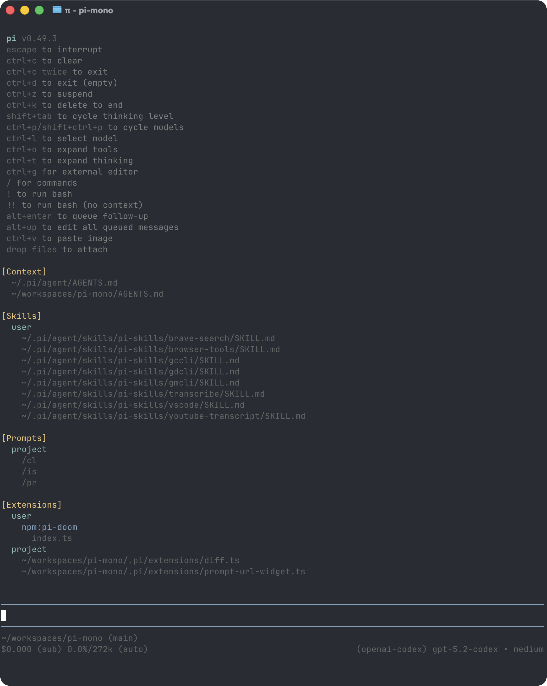

<p align="center">
  <a href="https://shittycodingagent.ai">
    
  </a>
</p>
<p align="center">
  <a href="https://discord.com/invite/nKXTsAcmbT"></a>
  <a href="https://www.npmjs.com/package/@mariozechner/pi-coding-agent"></a>
  <a href="https://github.com/badlogic/pi-mono/actions/workflows/ci.yml"></a>
</p>

Pi is a minimal terminal coding harness. Adapt pi to your workflows, not the other way around, without having to fork and modify pi internals. Extend it with TypeScript [Extensions](#extensions), [Skills](#skills), [Prompt Templates](#prompt-templates), and [Themes](#themes). Put your extensions, skills, prompt templates, and themes in [Pi Packages](#pi-packages) and share them with others via npm or git.

Pi ships with powerful defaults but skips features like sub agents and plan mode. Instead, you can ask pi to build what you want or install a third party pi package that matches your workflow.

Pi runs in four modes: interactive, print or JSON, RPC for process integration, and an SDK for embedding in your own apps. See [clawdbot/clawdbot](https://github.com/clawdbot/clawdbot) for a real-world SDK integration.

## Table of Contents

- [Quick Start](#quick-start)
- [Providers & Models](#providers--models)
- [Interactive Mode](#interactive-mode)
- [Sessions](#sessions)
- [Configuration](#configuration)
- [Customization](#customization)
- [CLI Reference](#cli-reference)
- [Programmatic Usage](#programmatic-usage)
- [Philosophy](#philosophy)

---

## Quick Start

```bash
npm install -g @mariozechner/pi-coding-agent
```

Authenticate with an API key:

```bash
export ANTHROPIC_API_KEY=sk-ant-...
pi
```

Or use your existing subscription:

```bash
pi
/login  # Then select provider
```

Then just talk to pi. Ask it to work on your codebase, run commands, or perform tasks for you.

**Platform notes:** [Windows](docs/windows.md) | [Terminal setup](docs/terminal-setup.md) | [Shell aliases](docs/shell-aliases.md)

---

## Providers & Models

For each built-in provider, pi maintains a list of tool-capable models, updated with every release. Authenticate via subscription (`/login`) or API key, then select any model from that provider via `/model` (or Ctrl+L).

**Subscriptions:**
- Anthropic Claude Pro/Max
- OpenAI ChatGPT Plus/Pro (Codex)
- GitHub Copilot
- Google Gemini CLI
- Google Antigravity

**API keys:**
- Anthropic
- OpenAI
- Azure OpenAI
- Google Gemini
- Google Vertex
- Amazon Bedrock
- Mistral
- Groq
- Cerebras
- xAI
- OpenRouter
- Vercel AI Gateway
- ZAI
- OpenCode Zen
- MiniMax

See [docs/providers.md](docs/providers.md) for detailed setup instructions.

**Custom providers & models:** Add providers via `~/.pi/agent/models.json` if they speak a supported API (OpenAI, Anthropic, Google). For custom APIs or OAuth, use extensions. See [docs/models.md](docs/models.md) and [docs/custom-provider.md](docs/custom-provider.md).

---

## Interactive Mode



Interactive mode lets you collaboratively work with pi on coding and other computer tasks. On startup, pi shows the most common shortcuts (use `/hotkeys` to see all), loaded AGENTS.md context files, and any prompt templates, skills, and extensions that have been loaded.

### Editor

| Feature | How |
|---------|-----|
| File reference | Type `@` to fuzzy-search project files |
| Path completion | Tab to complete paths |
| Multi-line | Shift+Enter (or Ctrl+Enter on Windows Terminal) |
| Images | Ctrl+V to paste, or drag onto terminal |
| Bash commands | Prefix with `!` (e.g., `!git status`) |

### Commands

| Command | Description |
|---------|-------------|
| `/login`, `/logout` | OAuth authentication |
| `/model` | Switch models |
| `/settings` | Thinking level, theme, message delivery |
| `/resume`, `/new` | Session management |
| `/tree`, `/fork` | Navigate and branch session history |
| `/compact` | Manually compact context |
| `/export`, `/share` | Export to HTML or GitHub gist |
| `/reload` | Reload extensions, skills, prompts, themes |
| `/hotkeys` | Show all keyboard shortcuts |

### Keyboard Shortcuts

See `/hotkeys` for the full list. Customize via `~/.pi/agent/keybindings.json`. See [docs/keybindings.md](docs/keybindings.md).

**Highlights:**

| Key | Action |
|-----|--------|
| Ctrl+P | Cycle models |
| Ctrl+L | Open model selector |
| Shift+Tab | Cycle thinking level |
| Ctrl+O | Toggle tool output |
| Ctrl+T | Toggle thinking blocks |
| Escape | Cancel/abort |

---

## Sessions

Sessions auto-save to `~/.pi/agent/sessions/` with tree structure for branching.

```bash
pi -c              # Continue most recent
pi -r              # Browse and select
pi --no-session    # Ephemeral mode
```

**Branching:** Use `/tree` to navigate history in-place, or `/fork` to create a new session from any point.

**Compaction:** Long sessions can exhaust context. Use `/compact` manually or enable auto-compaction in `/settings`.

See [docs/sessions.md](docs/sessions.md) for file format and branching details.

---

## Configuration

### Context Files

Pi loads `AGENTS.md` files at startup (global `~/.pi/agent/AGENTS.md`, parent directories, current directory). Use for project instructions, conventions, common commands.

### System Prompt

Replace the default system prompt with `.pi/SYSTEM.md` (project) or `~/.pi/agent/SYSTEM.md` (global). Append without replacing via `APPEND_SYSTEM.md`.

### Custom Models

Add Ollama, vLLM, LM Studio, or proxy endpoints via `~/.pi/agent/models.json`:

```json
{
  "providers": {
    "ollama": {
      "baseUrl": "http://localhost:11434/v1",
      "api": "openai-completions",
      "models": [{ "id": "llama-3.1-8b", "name": "Llama 3.1 8B", ... }]
    }
  }
}
```

See [docs/models.md](docs/models.md) for full schema and examples.

### Settings

Global settings in `~/.pi/agent/settings.json`, project overrides in `.pi/settings.json`.

See [docs/settings.md](docs/settings.md) for all options.

---

## Customization

### Themes

Built-in: `dark`, `light`. Create custom themes in `~/.pi/agent/themes/*.json` with live reload.

See [docs/themes.md](docs/themes.md).

### Prompt Templates

Reusable prompts as Markdown files in `~/.pi/agent/prompts/` or `.pi/prompts/`. Type `/name` to expand.

See [docs/prompt-templates.md](docs/prompt-templates.md).

### Skills

On-demand capability packages following the [Agent Skills standard](https://agentskills.io). Place in `~/.pi/agent/skills/` or `.pi/skills/`. Invoke via `/skill:name` or let the agent load them automatically.

See [docs/skills.md](docs/skills.md).

### Extensions

TypeScript modules for custom tools, commands, event interception, and UI.

```typescript
export default function (pi: ExtensionAPI) {
  pi.registerTool({ name: "deploy", ... });
  pi.registerCommand("stats", { ... });
  pi.on("tool_call", async (event, ctx) => { ... });
}
```

Place in `~/.pi/agent/extensions/` or `.pi/extensions/`.

See [docs/extensions.md](docs/extensions.md) and [examples/extensions/](examples/extensions/).

### Pi Packages

Bundle and share extensions, skills, prompts, and themes via npm or git:

```bash
pi install npm:@foo/pi-tools
pi install git:github.com/user/repo
pi list
pi update
```

See [docs/packages.md](docs/packages.md).

---

## CLI Reference

```bash
pi [options] [@files...] [messages...]
```

### Modes

| Flag | Description |
|------|-------------|
| (default) | Interactive mode |
| `-p`, `--print` | Print response and exit |
| `--mode json` | JSON event stream |
| `--mode rpc` | RPC mode for process integration |

### Common Options

| Option | Description |
|--------|-------------|
| `--provider`, `--model` | Select provider and model |
| `--thinking <level>` | `off`, `minimal`, `low`, `medium`, `high` |
| `--models <patterns>` | Patterns for Ctrl+P cycling |
| `-c`, `--continue` | Continue most recent session |
| `-r`, `--resume` | Browse and select session |
| `--tools <list>` | Limit tools (default: `read,bash,edit,write`) |

### File Arguments

```bash
pi @prompt.md "Answer this"
pi @screenshot.png "What's in this image?"
```

See `pi --help` for all options.

---

## Programmatic Usage

### SDK

```typescript
import { AuthStorage, createAgentSession, ModelRegistry, SessionManager } from "@mariozechner/pi-coding-agent";

const { session } = await createAgentSession({
  sessionManager: SessionManager.inMemory(),
  authStorage: new AuthStorage(),
  modelRegistry: new ModelRegistry(authStorage),
});

await session.prompt("What files are in the current directory?");
```

See [docs/sdk.md](docs/sdk.md) and [examples/sdk/](examples/sdk/).

### RPC Mode

```bash
pi --mode rpc --no-session
```

See [docs/rpc.md](docs/rpc.md) for the protocol.

### HTML Export

```bash
pi --export session.jsonl output.html
```

---

## Philosophy

**No MCP.** Build CLI tools with READMEs (see [Skills](#skills)). [Why?](https://mariozechner.at/posts/2025-11-02-what-if-you-dont-need-mcp/)

**No sub-agents.** Spawn pi instances via tmux, or build your own with [Extensions](#extensions).

**No permission popups.** Run in a container or build your own confirmation flow.

**No plan mode.** Write plans to files, start fresh for implementation.

Read the [blog post](https://mariozechner.at/posts/2025-11-30-pi-coding-agent/) for the full rationale.

---

## Development

See [docs/development.md](docs/development.md) for forking, rebranding, and debugging.

---

## License

MIT

## See Also

- [@mariozechner/pi-ai](https://www.npmjs.com/package/@mariozechner/pi-ai): Core LLM toolkit
- [@mariozechner/pi-agent](https://www.npmjs.com/package/@mariozechner/pi-agent): Agent framework
- [@mariozechner/pi-tui](https://www.npmjs.com/package/@mariozechner/pi-tui): Terminal UI components
